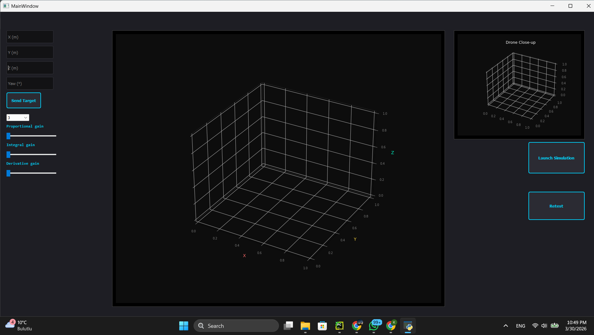
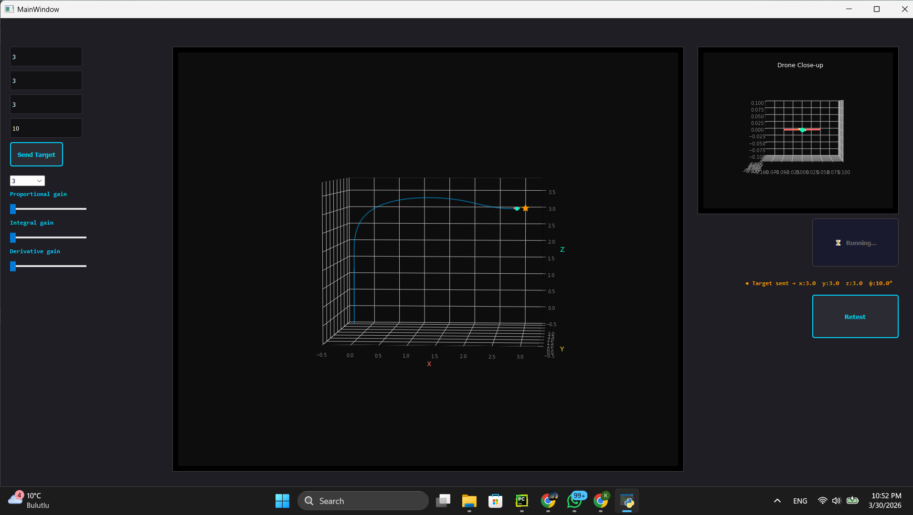

# UAV Ground Control Software and Simulator

This project is a UAV (Unmanned Aerial Vehicle) ground control software and simulator 
that integrates a physics-based flight model with a PyQt5 user interface. 
It allows real-time trajectory tracking, PID-based control, and live parameter tuning 
within a 3D visualization environment.

## Features

- Real-time UAV simulation
- PID-based flight control
- 3D visualization
- Live telemetry monitoring
- Adjustable flight parameters during simulation
- Modular PyQt5 interface (Qt Designer)

## System Architecture

The system consists of:
- Physics Engine: Simulates UAV dynamics
- Control System: PID-based trajectory tracking
- User Interface: PyQt5-based control panel
- Data Layer: Real-time parameter updates and telemetry flow

## Control Strategy

A PID controller is implemented to track user-defined XYZ positions and yaw angle.
The controller minimizes tracking error while ensuring stable system response.
Parameters can be tuned in real-time to observe system behavior.

## Demo

